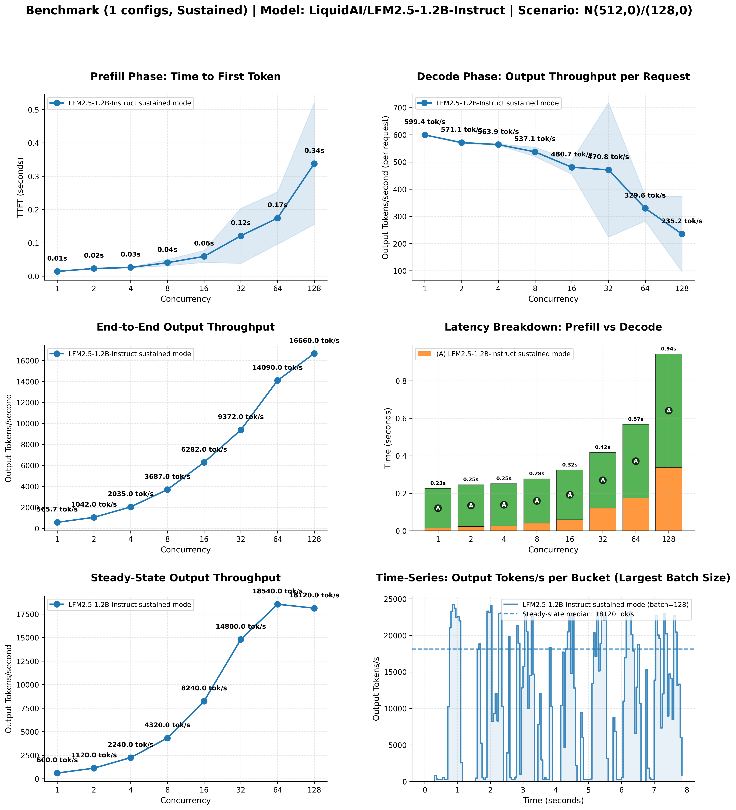

# Tokenomics

Benchmarking suite for OpenAI-compatible inference servers. Measures throughput, latency, and steady-state performance.



## Install

```bash
pip install tokenomics
```

### From source

```bash
git clone https://github.com/tugot17/tokenomics.git
cd tokenomics
uv venv --python 3.12 --seed && source .venv/bin/activate
uv pip install -e .
```

## Completion Benchmark

Sends chat completion requests to any OpenAI-compatible server and records per-request and system-wide metrics.

### Usage

```bash
# Burst mode — fires all requests at once
tokenomics completion \
  --dataset-config examples/dataset_configs/aime_simple.json \
  --scenario "N(100,50)/(50,0)" \
  --model your-model \
  --batch-sizes 1,2,4,8

# Sustained mode — maintains constant concurrency via semaphore
tokenomics completion \
  --dataset-config examples/dataset_configs/aime_simple.json \
  --scenario "N(100,50)/(50,0)" \
  --model your-model \
  --max-concurrency 1,2,4,8 \
  --num-prompts 128
```

The two modes are mutually exclusive. Burst is good for peak throughput; sustained gives realistic production numbers.

### Traffic Scenarios

| Pattern | Example | Description |
|---------|---------|-------------|
| `D(in,out)` | `D(100,50)` | Fixed token counts |
| `N(mu,sigma)/(mu,sigma)` | `N(100,50)/(50,0)` | Normal distribution |
| `U(min,max)/(min,max)` | `U(50,150)/(20,80)` | Uniform distribution |

### Datasets

The benchmark concatenates random text snippets from a dataset until it reaches the input token count specified by the scenario. Snippets are picked with replacement, so even a small dataset can produce long prompts. If the target is smaller than a single snippet, you get one full snippet (no truncation).

#### Dataset config format

A dataset config is a JSON file with a `source` section:

**Local file** (TXT, CSV, or JSON):
```json
{
  "source": { "type": "file", "path": "../data/prompts.txt" },
  "prompt_column": "text"
}
```
File paths are resolved relative to the config file.

**HuggingFace dataset:**
```json
{
  "source": {
    "type": "huggingface",
    "path": "squad",
    "huggingface_kwargs": { "split": "train" }
  },
  "prompt_column": "question"
}
```

**AIME** (built-in shortcut):
```json
{
  "source": { "type": "aime" }
}
```

See `examples/dataset_configs/` for more examples.

### Key Options

| Flag | Description |
|------|-------------|
| `--dataset-config` | Path to JSON dataset config (see `examples/dataset_configs/`) |
| `--scenario` | Traffic pattern |
| `--model` | Model name |
| `--api-base` | Server URL (default: `http://localhost:8000/v1`) |
| `--batch-sizes` | Burst mode sweep points |
| `--max-concurrency` | Sustained mode sweep points |
| `--num-prompts` | Prompts per sweep point in sustained mode |
| `--num-runs` | Runs per sweep point (default: 3) |
| `--max-tokens` | Max output tokens (default: 4096) |
| `--results-dir` | Output directory (one JSON per sweep value) |
| `--lora-strategy` | LoRA distribution: single, uniform, zipf, mixed, all-unique |
| `--lora-names` | Comma-separated LoRA adapter names |

### Metrics

**Per-request:**
- **TTFT** — time to first token (prefill latency)
- **Decode throughput** — output tokens/s per request
- **TPOT** — time per output token

**System-wide:**
- **End-to-end output throughput** — `total_output_tokens / wall_time`, includes ramp-up and drain
- **Steady-state output throughput** — median tok/s across time buckets where the batch is >= 80% full, isolating true decode performance

### Plotting

```bash
# Single benchmark
tokenomics plot-completion results_dir/ plot.png

# Compare multiple benchmarks
tokenomics plot-completion output.png results_dir1/ results_dir2/
```

Produces a 6-panel dashboard:

| | Left | Right |
|---|------|-------|
| **Row 1** | TTFT | Decode throughput per request |
| **Row 2** | End-to-end output throughput | Latency breakdown (prefill vs decode) |
| **Row 3** | Steady-state output throughput | Time-series token buckets |

## Embedding Benchmark

Tests concurrent embedding throughput.

```bash
tokenomics embedding \
  --model Qwen/Qwen3-Embedding-4B \
  --sequence_lengths "200" \
  --batch_sizes "1,8,16,32,64,128,256,512" \
  --num_runs 3 \
  --results-dir embedding_results/

tokenomics plot-embedding embedding_results/ embedding_plot.png
```


