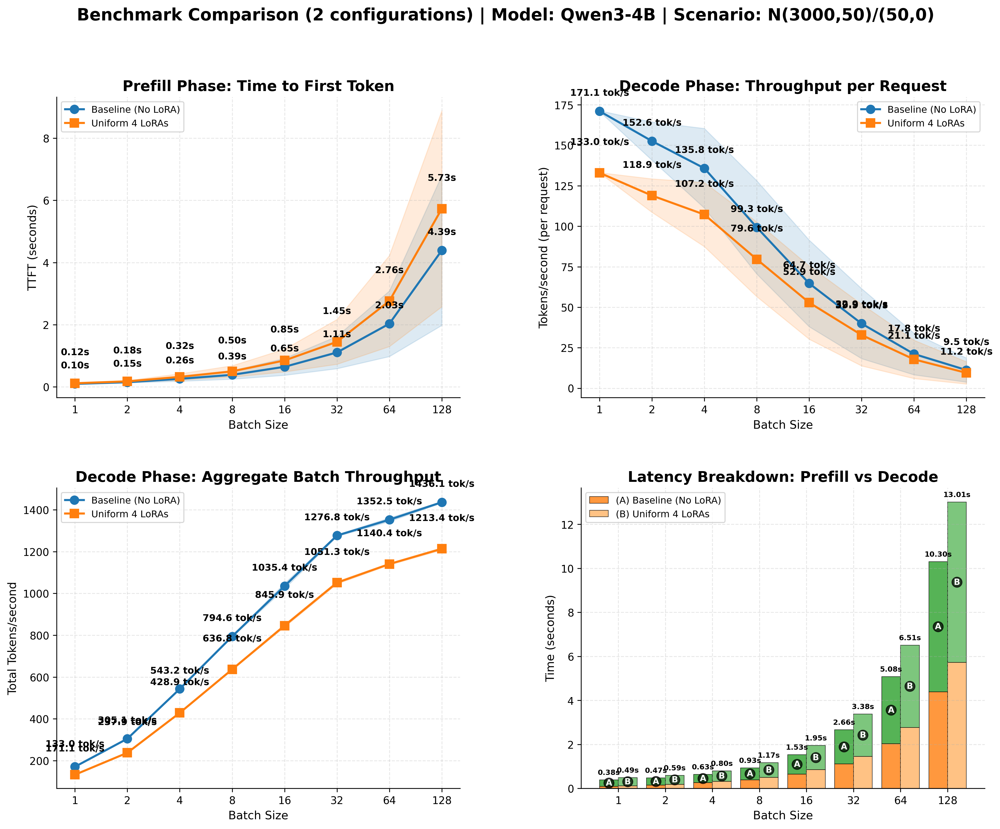
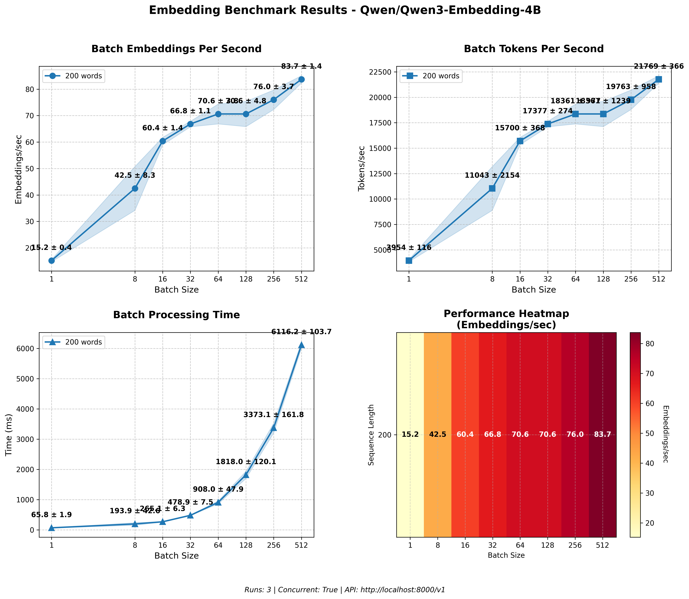

# Tokenomics

Benchmarking suite for OpenAI-compatible APIs. Measures tokens/s throughput, latency breakdown, and steady-state decode performance.


## Quick Start

```bash
# Install
uv venv --python 3.12 --seed && source .venv/bin/activate
uv pip install -r requirements.txt

# Start a server (vLLM or SGLang — adapt scripts to your model/TP config)
./server/vllm_run_server.sh

# Run benchmark
uv run completion_benchmark.py \
  --dataset-config examples/dataset_configs/aime_simple.json \
  --scenario "N(100,50)/(50,0)" \
  --model your-model \
  --batch-sizes 1,2,4,8 \
  --results-file results.json

# Plot results
uv run plot_benchmark.py results.json plot.png
```

Requires an OpenAI chat-compatible server ([vLLM](https://docs.vllm.ai/en/latest/serving/openai_compatible_server.html?ref=blog.mozilla.ai), [SGLang](https://docs.sglang.ai/backend/server_arguments.html), or any other).

## Completion Benchmark

Configurable benchmark with dataset loading, traffic scenarios, LoRA support, and time-bucketed metrics.

```bash
uv run completion_benchmark.py --dataset-config CONFIG --scenario SCENARIO [OPTIONS]
```

#### Options

| Flag | Description | Default |
|------|-------------|---------|
| `--dataset-config` | Path to JSON dataset config | required |
| `--scenario` | Traffic pattern (see below) | required |
| `--model` | Model name | required |
| `--api-base` | Server URL | `http://localhost:8000/v1` |
| `--batch-sizes` | Comma-separated batch sizes | `1,2,4,8` |
| `--num-runs` | Runs per batch size | `3` |
| `--results-file` | Output JSON path | `completion_benchmark_results.json` |
| `--steady-state-threshold` | Fraction of peak requests for steady-state | `0.8` |
| `--lora-strategy` | LoRA distribution (single, uniform, zipf, mixed, all-unique) | — |
| `--lora-names` | Comma-separated LoRA adapter names | — |
| `--base-model-ratio` | Fraction of requests using base model | `0.0` |

#### Traffic Scenarios

| Pattern | Description |
|---------|-------------|
| `D(in,out)` | Deterministic: fixed token counts |
| `N(μ_in,σ_in)/(μ_out,σ_out)` | Normal distribution |
| `U(min,max)/(min,max)` | Uniform distribution |
| `I(w,h)` or `I(w,h,n)` | Image dimensions |

#### What We Measure

**Per-request metrics** (averaged across all requests):

| Metric | Formula | Measures |
|--------|---------|----------|
| TTFT | Time to first token | Prefill latency |
| Decode throughput | `(output_tokens - 1) / decode_time` | Per-request decode speed |
| Input throughput | `input_tokens / ttft` | Prefill speed |

**System throughput** (across all concurrent requests):

| Metric | Formula | Measures |
|--------|---------|----------|
| Steady-state TPS | Median tok/s across 1s buckets where ≥80% of peak requests are decoding | Decode throughput at full batch, excluding ramp-up and drain |
| End-to-end TPS | `total_output_tokens / wall_time` | Total throughput including prefill and drain |

The steady-state metric bins chunk timestamps into 1-second buckets, counts actively decoding requests per bucket (from TTFT onward), and keeps only buckets where the batch is ≥80% full (configurable via `--steady-state-threshold`).

#### Dataset Configuration

Datasets are configured via JSON files (see `examples/dataset_configs/`):

```json
{
  "source": {
    "type": "huggingface",
    "path": "squad",
    "huggingface_kwargs": {"split": "train"}
  },
  "prompt_column": "question"
}
```

Supports HuggingFace datasets, local files (CSV, JSON, TXT), and multimodal (image) datasets.

#### Plotting

```bash
# Single benchmark
uv run plot_benchmark.py results.json plot.png

# Compare multiple benchmarks
uv run plot_benchmark.py comparison.png results1.json results2.json results3.json
```



## Embedding Benchmark

Tests concurrent embedding throughput by sending parallel requests.

```bash
uv run embedding_benchmark.py --model MODEL --sequence_lengths LENGTHS [OPTIONS]
```

#### Options

| Flag | Description | Default |
|------|-------------|---------|
| `--model` | Embedding model tag | required |
| `--api_base` | Server URL | `http://localhost:8000/v1` |
| `--batch_sizes` | Concurrent request counts | `1,2,4,8,16` |
| `--sequence_lengths` | Categories (short/medium/long) or word counts | required |
| `--num_runs` | Runs per configuration | `3` |
| `--results_file` | Output JSON path | — |

```bash
# Example
uv run embedding_benchmark.py \
  --model Qwen/Qwen3-Embedding-4B \
  --sequence_lengths "200" \
  --batch_sizes "1,8,16,32,64,128,256,512" \
  --num_runs 3 \
  --results_file embedding_results.json

# Plot
uv run plot_embedding_benchmark.py embedding_results.json embedding_plot.png
```



## Limitations

- **Open-loop design**: All requests fire at once. The steady-state filter mitigates ramp-up/drain noise, but doesn't maintain constant concurrency (unlike closed-loop tools like SGLang's `bench_serving --max-concurrency`).
- **Chunk-based token counting**: Time-series counts SSE chunks as tokens (~99.8% accurate for most servers). Servers that batch multiple tokens per chunk would undercount.
