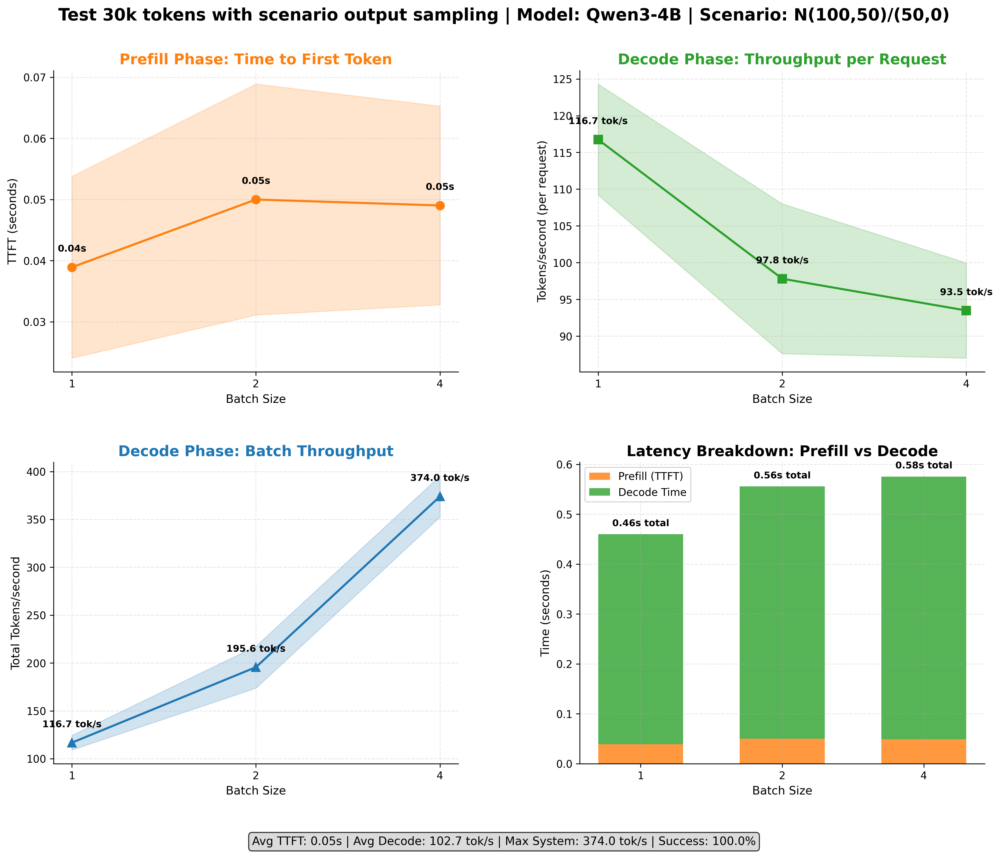

# Tokenomics 🚀📈📊

Comprehensive benchmarking suite for OpenAI-compatible APIs. Measure tokens/s performance, test different datasets, and analyze throughput across various configurations.


## 📋 Overview

This repository provides three specialized benchmarking tools:

- **🚀 Simple Completion Benchmark**: Quick server performance testing with built-in datasets
- **🔬 Advanced Completion Benchmark**: Research-grade testing with flexible dataset configurations and multimodal support
- **📊 Embedding Benchmark**: Concurrent embedding model performance analysis

## 🚀 Quick Start

```bash
# Install dependencies
uv venv --python 3.12 --seed && source .venv/bin/activate
uv pip install -r requirements.txt

# Start a server (optional - use your own or our test server)
./server/vllm_run_server.sh

# Run simple completion benchmark
uv run completion_simple_benchmark.py --model your-model --dataset_key aime
```

## 🔧 Server Setup

To run the performance tests, you need two things:

- An OpenAI chat-compatible server

- Script calling the API

In principle, you can run any OAI-compatible server, such as [vLLM](https://docs.vllm.ai/en/latest/serving/openai_compatible_server.html?ref=blog.mozilla.ai) or [SGLang](https://docs.sglang.ai/backend/server_arguments.html). 

Both server packages have a lot of parameters, so to facilitate running them, we created two scripts to quickly spin them up with hardcoded values of model paths, TP configuration, etc. You should adapt these to your needs, e.g., use a different path for the model weights, a different TP config, etc.

To run the VLLM server, run:

```bash
./server/vllm_run_server.sh
```

To run the SGLang server run:

```bash
./server/sglang_run_server.sh
```


## 📊 Benchmarking Tools

### 🚀 Simple Completion Benchmark (Production Testing)

For quick server performance testing with minimal configuration:

```bash
uv run completion_simple_benchmark.py --model MODEL_NAME --dataset_key DATASET_NAME [OPTIONS]
```

### Key Options
- `--model`: Model tag that you run withing the api (e.g., 'distill-llama-8b')
- `--api_base`: vLLM server URL (default: http://localhost:8000/v1)
- `--batch_sizes`: Comma-separated batch sizes (default: 1,2,4,8)
- `--num_runs`: Number of runs per batch size (default: 3)
- `--dataset_key`: Dataset to use (default: aime)
- `--results_file`: Output JSON file path

E.g. config for VLLM server

```bash
uv run completion_simple_benchmark.py --model distill-llama-8b --dataset_key aime --api_base http://localhost:8000/v1 --batch_sizes 1,2,4,8 --num_runs 3 --max_tokens 100 --temperature 0.5 --description "Deepseek R1 distill 8B TP8 A100s" --results_file my_server_benchmark.json
```

We measure the performance against different batch sizes. Note you need to guarantee that no other tenants are using the API at the same time as you do; otherwise, you will get flawed performance numbers. 

The result is a `.json` file looks something like this:

```json
{
  "metadata": {
    "timestamp": "2025-02-04T21:33:32.902353",
    "model": "distill-llama-8b",
    ...
  },
  "results": {
    ...
    "64": {
      "tokens": {
        "input_per_request": {
          "mean": 112.578125,
          "std": 55.21709922324872
        },
        "output_per_request": {
          "mean": 6211.13125,
          "std": 3030.1517578348125
        }
      },
      "timings": {
        "batch_total_seconds": {
          "mean": 106.69955926425754,
          "std": 5.002876034171101
        },
        "fastest_seconds": {
          "mean": 5.34426054880023,
          "std": 1.6415655967821245
        },
        "slowest_seconds": {
          "mean": 106.69714294858277,
          "std": 5.002909157480276
        },
        "spread_seconds": {
          "mean": 101.35288239978254,
          "std": 4.984463398447948
        }
      },
      "throughput": {
        "batch_tokens_per_second": {
          "mean": 3729.295223546461,
          "std": 122.2431365137911
        },
        "request_tokens_per_second": {
          "mean": 159.1587231541266,
          "std": 8.273409865481359
        }
      }
    }
  }
}
```

Post generation use the following line to plot the throghput:

```bash
uv run plot_throughput.py <PATH-TO-JSON-OUTPUT> <PATH-TO-IMAGE-WITH-VISUALIZATION>
```

E.g.

```bash
uv run plot_throughput.py my_server_benchmark.json my_output.png
```


### 🔬 Advanced Completion Benchmark (Research & Development)

For more sophisticated benchmarking needs, the advanced benchmark provides flexible dataset configuration, multimodal support, and research-oriented features through JSON configuration files.

### Key Features
- **Flexible Data Sources**: Local files (CSV, JSON, TXT), HuggingFace datasets, custom loaders
- **Dataset Configuration**: JSON-based configuration system for reproducible experiments
- **Multimodal Support**: Text-to-text, image-to-text, embeddings, and reranking tasks
- **Traffic Scenarios**: Configurable input/output token distributions
- **Research Tools**: Advanced plotting, detailed metrics, experiment tracking

### How to run advanced benchmarks?

The advanced benchmark uses JSON configuration files to define datasets and scenarios:

```bash
uv run completion_advanced_benchmark.py --dataset-config CONFIG_FILE --scenario SCENARIO [OPTIONS]
```

### Key Options for Advanced Benchmark
- `--dataset-config`: Path to JSON dataset configuration file
- `--scenario`: Traffic pattern (e.g., "N(100,50)/(50,0)", "D(100,100)")
- `--model`: Model name/tag
- `--api-base`: Server URL (default: http://localhost:8000/v1)
- `--batch-sizes`: Comma-separated batch sizes (default: 1,2,4,8)
- `--results-file`: Output JSON file path

### Dataset Configuration Examples

**Simple HuggingFace Dataset** (`examples/dataset_configs/huggingface_squad.json`):
```json
{
  "source": {
    "type": "huggingface",
    "path": "squad",
    "huggingface_kwargs": {"split": "train"}
  },
  "prompt_column": "question"
}
```

**Local CSV File** (`examples/dataset_configs/csv_dataset.json`):
```json
{
  "source": {
    "type": "file",
    "path": "/data/prompts.csv",
    "file_format": "csv"
  },
  "prompt_column": "prompt"
}
```

**Multimodal Dataset** (`examples/dataset_configs/llava_config.json`):
```json
{
  "source": {
    "type": "huggingface",
    "path": "lmms-lab/llava-bench-in-the-wild",
    "huggingface_kwargs": {"split": "train"}
  },
  "prompt_column": "question",
  "image_column": "image"
}
```

### Example Usage

```bash
# Text generation with AIME dataset
uv run completion_advanced_benchmark.py \
  --dataset-config examples/dataset_configs/aime_simple.json \
  --scenario "N(100,50)/(50,0)" \
  --model Qwen3-4B \
  --api-base http://localhost:8000/v1 \
  --batch-sizes 1,2,4,8 \
  --results-file advanced_results.json

# Multimodal benchmark
uv run completion_advanced_benchmark.py \
  --dataset-config examples/dataset_configs/llava_config.json \
  --scenario "I(512,512)" \
  --model llava-model \
  --results-file multimodal_results.json
```

### Traffic Scenarios
- **Deterministic**: `D(input_tokens,output_tokens)` - Fixed token counts
- **Normal Distribution**: `N(mean_input,std_input)/(mean_output,std_output)` - Gaussian distribution
- **Uniform Distribution**: `U(min_input,max_input)/(min_output,max_output)` - Uniform range
- **Image Scenarios**: `I(width,height)` or `I(width,height,num_images)` - Image dimensions
- **Embedding**: `E(tokens_per_document)` - Fixed document size
- **Rerank**: `R(doc_tokens,query_tokens)` - Document/query reranking

### Advanced Results Format

The advanced benchmark generates detailed JSON results with comprehensive metrics:

```json
{
  "metadata": {
    "timestamp": "2025-07-23T08:47:59.815182",
    "model": "Qwen3-4B",
    "scenario": "N(100,50)/(50,0)",
    "dataset_config": {
      "source": {"type": "aime"},
      "prompt_column": "Question",
      "description": "Simple AIME dataset configuration using existing dataset loader"
    },
    "api_base": "http://localhost:8000/v1",
    "batch_sizes": [1, 2, 4],
    "num_runs": 3,
    "warmup_runs": 3,
    "temperature": 0.7,
    "description": "Test 30k tokens with scenario output sampling"
  },
  "results": {
    "1": {
      "tokens": {
        "input_per_request": {"mean": 217, "std": 142.03},
        "output_per_request": {"mean": 50, "std": 0.0}
      },
      "timings": {
        "batch_total_seconds": {"mean": 0.461, "std": 0.029},
        "fastest_seconds": {"mean": 0.460, "std": 0.029},
        "slowest_seconds": {"mean": 0.460, "std": 0.029},
        "spread_seconds": {"mean": 0.0, "std": 0.0}
      },
      "prefill_metrics": {
        "ttft": {"mean": 0.039, "std": 0.015},
        "input_throughput": {"mean": 5232.07, "std": 1356.12}
      },
      "decode_metrics": {
        "output_throughput": {"mean": 116.74, "std": 7.55},
        "tpot": {"mean": 0.0086, "std": 0.0006},
        "decode_time": {"mean": 0.421, "std": 0.028}
      },
      "batch_metrics": {
        "combined_throughput": {"mean": 116.74, "std": 7.55},
        "batch_duration": {"mean": 0.461, "std": 0.029}
      },
      "reliability": {
        "total_requests": 3,
        "successful_requests": 3,
        "failed_requests": 0,
        "success_rate": 100.0,
        "failure_rate": 0.0
      }
    }
  }
}
```

Key metrics include:
- **Prefill metrics**: Time to first token (TTFT), input throughput
- **Decode metrics**: Output throughput, time per output token (TPOT)
- **Batch metrics**: Combined throughput, batch processing duration
- **Reliability**: Success/failure rates and request counts
- **Dataset tracking**: Full configuration and scenario details preserved

### Advanced Plotting

Generate comprehensive visualizations with:

```bash
uv run plot_advanced_benchmark.py advanced_results.json advanced_plot.png
```



### 📊 Embedding Benchmarks

In addition to LLM throughput benchmarks, this repository also supports embedding model benchmarks. The embedding benchmark tests concurrent performance by sending multiple separate requests to measure embedding throughput.

### How to run embedding benchmarks?

Running the embedding benchmark follows a similar pattern to the LLM benchmark:

```bash
uv run embedding_benchmark.py --model MODEL_NAME --sequence_lengths LENGTHS [OPTIONS]
```

### Key Options for Embeddings
- `--model`: Embedding model tag (e.g., 'sentence-transformers/all-MiniLM-L6-v2')
- `--api_base`: Server URL (default: http://localhost:8000/v1)
- `--batch_sizes`: Comma-separated batch sizes for concurrent requests (default: 1,2,4,8,16)
- `--sequence_lengths`: Text lengths - categories (short,medium,long,mixed) or word counts (10,25,50,200)
- `--num_runs`: Number of runs per configuration (default: 3)
- `--results_file`: Output JSON file path

Example configuration for embedding server:

```bash
uv run embedding_benchmark.py --model Qwen/Qwen3-Embedding-4B --sequence_lengths "200" --batch_sizes "1,8,16,32,64,128,256,512" --num_runs 3 --description "Qwen3 4B Embedding TP1 A100" --results_file embedding_results.json
```

The embedding benchmark tests concurrent performance by sending separate requests simultaneously (e.g., 512 separate API calls with 1 text each) rather than single large batched requests.

After running the benchmark, generate visualizations with:

```bash
uv run plot_embedding_benchmark.py embedding_results.json embedding_plot.png
```


## 📊 Visualization & Analysis

All benchmarks generate JSON results that can be visualized:

```bash
# Simple completion benchmark results
uv run plot_throughput.py results.json output.png

# Advanced completion benchmark results  
uv run plot_advanced_benchmark.py advanced_results.json advanced_plot.png

# Embedding benchmark results
uv run plot_embedding_benchmark.py embedding_results.json embedding_plot.png
```

## ⚙️ Installation


```bash
uv venv --python 3.12 --seed

source .venv/bin/activate

uv pip install -r requirements.txt
```

To run a `vllm` server install via 

```bash
uv pip install vllm
```

To run a sglang server via

```bash
uv pip install --upgrade pip
uv pip install sgl-kernel --force-reinstall --no-deps
uv pip install "sglang[all]" --find-links https://flashinfer.ai/whl/cu124/torch2.4/flashinfer/
```


## ⚠️ Limitations

### Simple Completion Benchmark Limitations
- This setup only works well simulating short prefill workloads. In AIME, each request is <200 tokens, so usually the majority of the time is spent in decoding anyway. This means that we combine the end-to-end time, effectively assuming prefill is "instant." While it is an ok heuristic to measure the decode speed at short prompt lengths, you need to be aware of the limitations.
- All of the requests are sent concurrently, and they have similar short context prompts. This is very unlikely to be the case in a real-world setup, and especially in the chat applications. 


### Advanced Completion Benchmark Improvements
- Since the benchmark is streaming-based on different requests, there is no reliable way to say which requests run concurrently. We measure the throughput per request, and to estimate the combined throughput, we simply add all the throughputs from all the requests. However, it only works if decode is substantially longer than prefill. Otherwise we might find ourselves in a situation where some requests are in the prefill phase, some are in the decode phase, the decode phase ends, and the other requests are moved from prefill and put into decode, so effectively the decode phase is happening with a smaller batch size than we expect. This problem is espe
